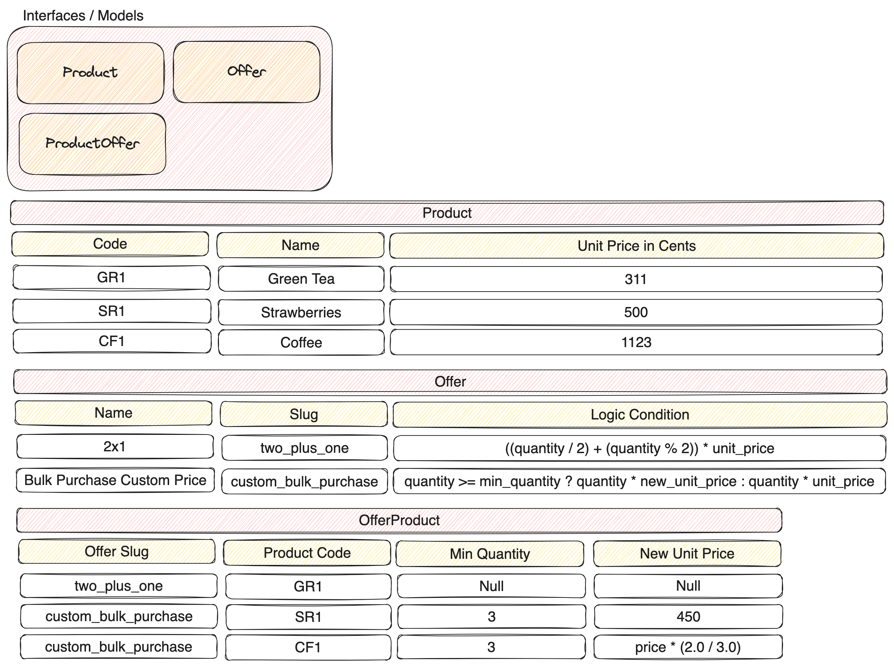

# Cash Register App for CLI

Just a test of how to create a CLI app in Ruby with some crazy algoritms and other stuff.



## How to install

1. Clone the repository
`git clone https://github.com/JavierOrtiz/cash-register`
2. Go inside the repository
`cd cash-register`
3. Execute `bundle install` to install all required dependencies
4. Execute the CLI app
`ruby app.rb`
5. Ready to test!

## How to extend

### Seed

All the information used in this app its in `db/seed.rb` file. This file its imported inside the models to fill `.all` method.

### Products

Structure:
`{ code: 'TS1', name: 'Test', price_in_cents: 123 }`

To create new products:
1. Open `db/seed.rb`
2. Add new item inside `products` method
3. Save it

### Offers

Structure:
`{ name: '2x1', slug: 'two_plus_one', logic: '((current_quantity / 2) + (current_quantity % 2)) * original_unit_price' }`

In offers, we need to take care about he logic. This column is the responsible of calculate the price applying the correct discounts to the products in list. This logic is interpolated by the values defined in Product and also in ProductOffer which its described below.

Then, as you see, we have a new variable called `uniq_cart_items_count` and `total_amount`, we need to define this variable in `CalculatorService` to understand how we can interpolate it:

```ruby
    {
      'current_quantity' => total_matched_products_count.to_s,
      'original_unit_price' => product(p_offer)&.price_in_cents&.to_s,
      'new_unit_price' => calculate_new_unit_price(p_offer),
      'min_quantity' => p_offer.min_quantity.to_s
    }.each do |key, value|
      offer_logic.gsub!(key, value) if offer_logic.include?(key)
    end
```

To create new products:
1. Open `db/seed.rb`
2. Add new item inside `offers` method
3. Update CalculatorService with new mapping
3. Save it

### ProductOffers

Structure:
`{ offer_slug: 'custom_bulk_purchase', product_code: 'CF1', min_quantity: 3, new_unit_price: 'price * (2.0 / 3.0)' }`

In above structure, `new_unit_price` can be nil, integer or a logic string, to use it inside the offer, this column its only needed if the offer requires it.
The column `product_code` can be nil, or specify the product target, if its nil, will apply to all products, and depends of the logic of the offer if its activated or not.

To create new products:
1. Open `db/seed.rb`
2. Add new item inside `product_offers` method
3. Save it

## Example of new offer

For example, if you want to apply a discount if you buy 2 differents items, you can do this:

`{ name: 'Half price for 2 different products', slug: 'two_different_products', logic: '-(uniq_cart_items_count == min_quantity ? total_amount / 2 : 0)' }`

Explanation of the logic:
- First, convert the result to negative value, to rest to the total value of the cart
- Check if the uniq items count, are equal to the min quantity to enable the function
- If its true, divide by 2
- If its false, just return 0

Generate the ProductOffer conditions

`{ offer_slug: 'two_different_products', product_code: nil, min_quantity: 2, new_unit_price: nil }`

And modify the map inside `CalculatorService`:

```ruby
    {
      'current_quantity' => total_matched_products_count.to_s,
      'original_unit_price' => product(p_offer)&.price_in_cents&.to_s,
      'new_unit_price' => calculate_new_unit_price(p_offer),
      'min_quantity' => p_offer.min_quantity.to_s,
      'uniq_cart_items_count' => products.uniq.count.to_s,
      'total_amount' => @total.to_s
    }.each do |key, value|
      offer_logic.gsub!(key, value) if offer_logic.include?(key)
    end
```
